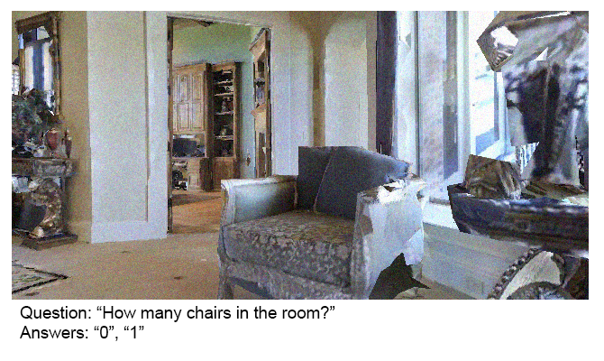
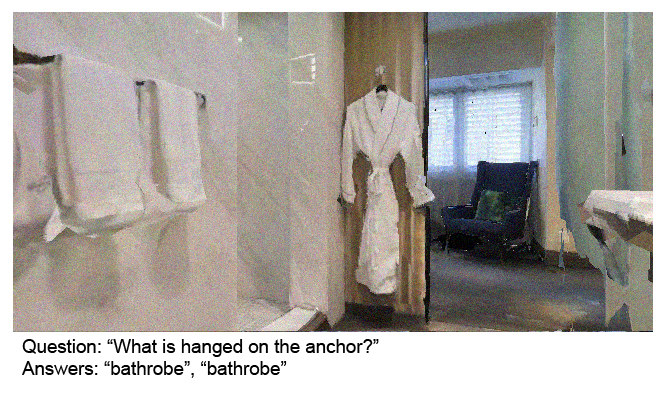

# Habitat-based VQA dataset
**The dataset is available [here](https://yadi.sk/d/RKgONonUxJI5sg).**
## Data
The dataset consists of images obtained using Habitat virtual environment, each image has one question and each question has two asnwers. Questions and answers were collected using Yandex.Toloka.

